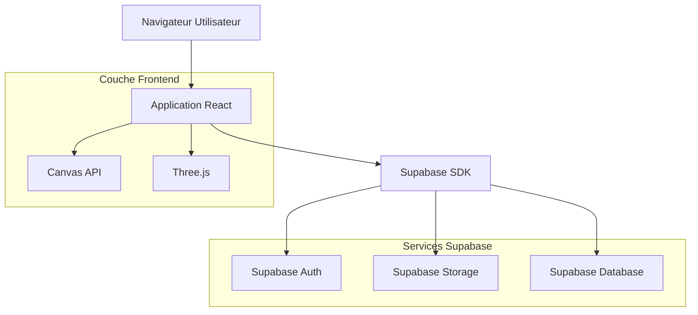
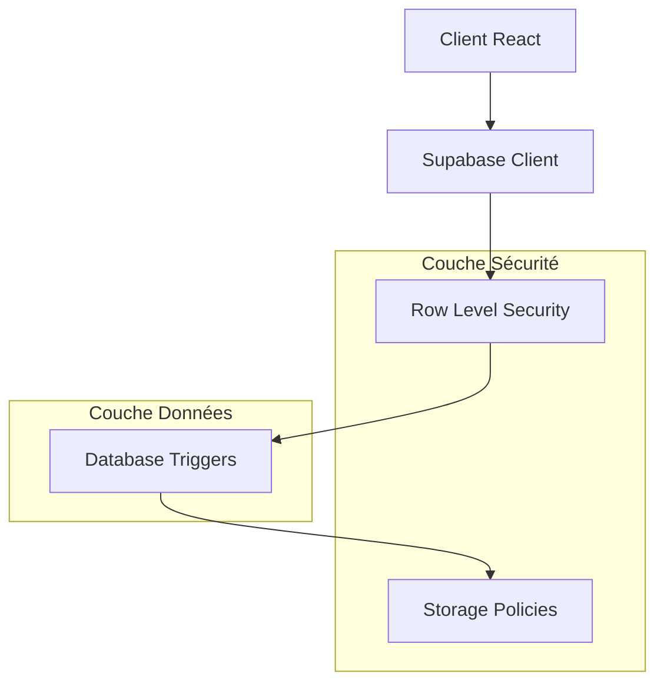
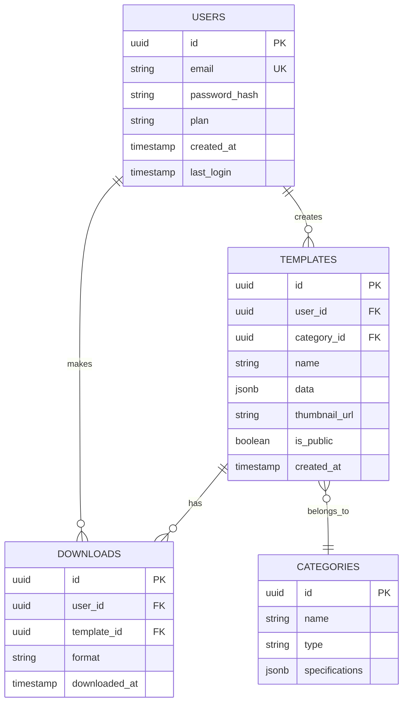

## 1. Architecture du système



## 2. Description des technologies

- **Frontend** : React@18 + TypeScript + Vite
- **Styling** : TailwindCSS@3 + Framer Motion (animations)
- **UI Components** : Radix UI + Lucide React (icônes)
- **Canvas** : Konva.js (2D) + Three.js (3D previews)
- **Backend** : Supabase (Auth, Database, Storage)
- **Outil d'initialisation** : vite-init

## 3. Définition des routes

| Route | Objectif |
|-------|----------|
| `/` | Page d'accueil premium avec hero et vitrine |
| `/catalogue/moto` | Catalogue consolidé des gabarits moto |
| `/createur` | Créateur universel de gabarits |
| `/createur/voiture` | Interface création gabarits voiture |
| `/createur/maison` | Interface création gabarits maison |
| `/createur/bateau` | Interface création gabarits bateau |
| `/espace-client` | Dashboard utilisateur connecté |
| `/espace-client/projets` | Bibliothèque des créations |
| `/support` | Centre d'aide et tutoriels |
| `/auth/login` | Page de connexion |
| `/auth/register` | Page d'inscription |

## 4. Définitions API

### 4.1 API d'authentification Supabase
```typescript
// Types communs
interface User {
  id: string
  email: string
  plan: 'free' | 'premium'
  created_at: string
}

interface AuthResponse {
  user: User | null
  session: Session | null
  error: AuthError | null
}
```

### 4.2 API de gestion des gabarits
```typescript
// Créer un nouveau gabarit
POST /api/templates

Request:
interface CreateTemplateRequest {
  name: string
  category: 'moto' | 'voiture' | 'maison' | 'bateau'
  dimensions: {
    width: number
    height: number
    depth?: number
  }
  data: object // Structure JSON du gabarit
}

Response:
interface TemplateResponse {
  id: string
  name: string
  thumbnail_url: string
  download_url: string
  created_at: string
}
```

### 4.3 API de téléchargement
```typescript
// Télécharger un gabarit
GET /api/templates/:id/download?format=pdf|svg|png

Response: Blob du fichier
```

## 5. Architecture serveur



## 6. Modèle de données

### 6.1 Schéma de base de données


### 6.2 Langage de définition des données

**Table des utilisateurs**
```sql
CREATE TABLE users (
    id UUID PRIMARY KEY DEFAULT gen_random_uuid(),
    email VARCHAR(255) UNIQUE NOT NULL,
    password_hash VARCHAR(255) NOT NULL,
    plan VARCHAR(20) DEFAULT 'free' CHECK (plan IN ('free', 'premium')),
    created_at TIMESTAMP WITH TIME ZONE DEFAULT NOW(),
    last_login TIMESTAMP WITH TIME ZONE DEFAULT NOW()
);

-- Index pour les performances
CREATE INDEX idx_users_email ON users(email);
CREATE INDEX idx_users_plan ON users(plan);
```

**Table des gabarits**
```sql
CREATE TABLE templates (
    id UUID PRIMARY KEY DEFAULT gen_random_uuid(),
    user_id UUID REFERENCES users(id) ON DELETE CASCADE,
    category_id UUID REFERENCES categories(id),
    name VARCHAR(255) NOT NULL,
    data JSONB NOT NULL,
    thumbnail_url TEXT,
    is_public BOOLEAN DEFAULT false,
    created_at TIMESTAMP WITH TIME ZONE DEFAULT NOW(),
    updated_at TIMESTAMP WITH TIME ZONE DEFAULT NOW()
);

-- Index pour la recherche
CREATE INDEX idx_templates_user_id ON templates(user_id);
CREATE INDEX idx_templates_category ON templates(category_id);
CREATE INDEX idx_templates_public ON templates(is_public) WHERE is_public = true;
```

**Table des catégories**
```sql
CREATE TABLE categories (
    id UUID PRIMARY KEY DEFAULT gen_random_uuid(),
    name VARCHAR(100) NOT NULL,
    type VARCHAR(50) CHECK (type IN ('moto', 'voiture', 'maison', 'bateau')),
    specifications JSONB,
    created_at TIMESTAMP WITH TIME ZONE DEFAULT NOW()
);

-- Données initiales
INSERT INTO categories (name, type, specifications) VALUES
('Sport', 'moto', '{"wheels": 2, "typical_size": {"width": 2000, "height": 1200}}'),
('Cruiser', 'moto', '{"wheels": 2, "typical_size": {"width": 2500, "height": 1300}}'),
('Berline', 'voiture', '{"wheels": 4, "typical_size": {"width": 4800, "height": 1800}}'),
('Maison individuelle', 'maison', '{"floors": 2, "typical_size": {"width": 10000, "height": 8000}}'),
('Bateau de plaisance', 'bateau', '{"hull_type": "monocoque", "typical_size": {"width": 8000, "height": 3000}}');
```

### 6.3 Politiques de sécurité Supabase
```sql
-- Politiques RLS pour templates
ALTER TABLE templates ENABLE ROW LEVEL SECURITY;

-- Lecture publique des templates publics
CREATE POLICY "Public templates are viewable by everyone" 
ON templates FOR SELECT 
USING (is_public = true);

-- Les utilisateurs peuvent voir leurs propres templates
CREATE POLICY "Users can view own templates" 
ON templates FOR SELECT 
USING (auth.uid() = user_id);

-- Insertion pour utilisateurs authentifiés
CREATE POLICY "Authenticated users can create templates" 
ON templates FOR INSERT 
WITH CHECK (auth.uid() = user_id);

-- Mise à jour pour propriétaires
CREATE POLICY "Users can update own templates" 
ON templates FOR UPDATE 
USING (auth.uid() = user_id);
```

### 6.4 Configuration Storage Supabase
```sql
-- Bucket pour les thumbnails
create storage.bucket_template_thumbnails
create storage.bucket_user_exports

-- Politiques d'accès
CREATE POLICY "Public access for template thumbnails" 
ON storage.objects FOR SELECT 
USING (bucket_id = 'template_thumbnails');

CREATE POLICY "Users can upload own exports" 
ON storage.objects FOR INSERT 
WITH CHECK (bucket_id = 'user_exports' AND auth.uid() = (storage.foldername(name))[1]);
```