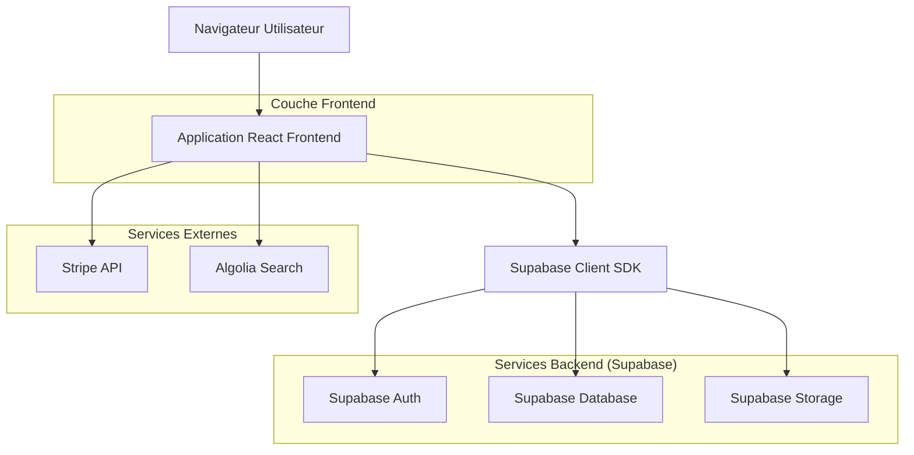
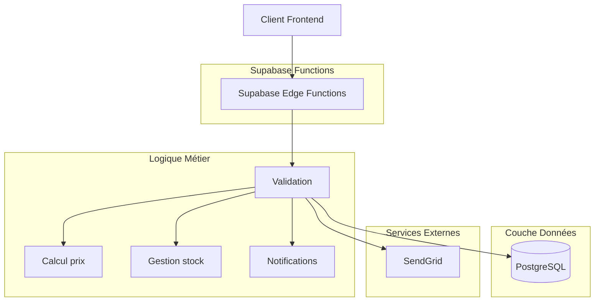
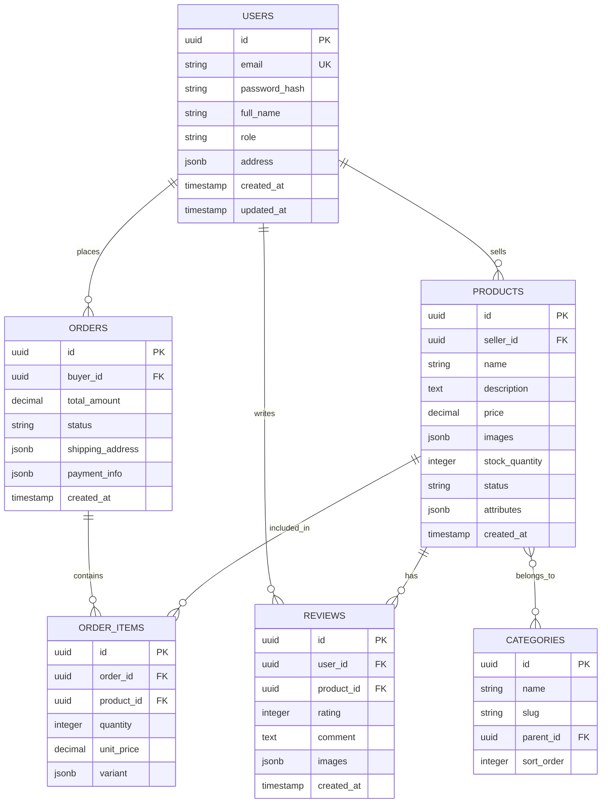

## 1. Architecture du système



## 2. Description des technologies

* **Frontend** : React\@18 + TypeScript + TailwindCSS\@3 + Vite

* **Outil d'initialisation** : vite-init

* **Backend** : Supabase (BaaS complet)

* **Base de données** : PostgreSQL (via Supabase)

* **Authentification** : Supabase Auth

* **Stockage fichiers** : Supabase Storage

* **Recherche** : Algolia (indexation produits)

* **Paiement** : Stripe API

* **État global** : Zustand

* **Routing** : React Router v6

* **UI Components** : HeadlessUI + Radix UI

* **Charts/Analytics** : Chart.js + Recharts

## 3. Définition des routes

| Route             | Objectif                                                  |
| ----------------- | --------------------------------------------------------- |
| /                 | Page d'accueil avec hero, catégories et produits tendance |
| /search           | Page recherche avec filtres avancés et résultats          |
| /product/:id      | Page détail produit avec galerie et informations          |
| /cart             | Panier avec résumé visuel et suggestions                  |
| /checkout         | Processus de commande multi-étapes                        |
| /account          | Dashboard utilisateur personnalisé                        |
| /account/orders   | Historique et suivi des commandes                         |
| /account/wishlist | Liste de souhaits de l'utilisateur                        |
| /seller/dashboard | Tableau de bord vendeur avec analytics                    |
| /seller/products  | Gestion du catalogue produits                             |
| /seller/orders    | Gestion des commandes vendeur                             |
| /auth/login       | Page connexion avec multi-fournisseurs                    |
| /auth/register    | Inscription acheteur/vendeur                              |

## 4. Définitions API

### 4.1 API Produit

```
GET /api/products/search
```

Requête :

| Paramètre | Type   | Requis | Description                   |
| --------- | ------ | ------ | ----------------------------- |
| query     | string | false  | Terme de recherche            |
| category  | string | false  | Filtrer par catégorie         |
| minPrice  | number | false  | Prix minimum                  |
| maxPrice  | number | false  | Prix maximum                  |
| sortBy    | string | false  | tri: relevance, price, rating |
| page      | number | false  | Page de résultats             |

Réponse :

```json
{
  "products": [
    {
      "id": "uuid",
      "name": "string",
      "price": "number",
      "images": ["string"],
      "rating": "number",
      "reviewsCount": "number",
      "seller": {
        "id": "uuid",
        "name": "string",
        "rating": "number"
      }
    }
  ],
  "total": "number",
  "page": "number",
  "totalPages": "number"
}
```

### 4.2 API Panier

```
POST /api/cart/add
```

Requête :

| Paramètre | Type   | Requis | Description           |
| --------- | ------ | ------ | --------------------- |
| productId | string | true   | ID du produit         |
| quantity  | number | true   | Quantité à ajouter    |
| variant   | object | false  | Variante sélectionnée |

### 4.3 API Commande

```
POST /api/orders/create
```

Requête :

```json
{
  "items": [
    {
      "productId": "uuid",
      "quantity": "number",
      "price": "number"
    }
  ],
  "shippingAddress": {
    "street": "string",
    "city": "string",
    "postalCode": "string",
    "country": "string"
  },
  "paymentMethodId": "string"
}
```

## 5. Architecture serveur



## 6. Modèle de données

### 6.1 Schéma de base de données



### 6.2 Langage de définition des données

**Table des utilisateurs (users)**

```sql
-- création table
CREATE TABLE users (
  id UUID PRIMARY KEY DEFAULT gen_random_uuid(),
  email VARCHAR(255) UNIQUE NOT NULL,
  password_hash VARCHAR(255) NOT NULL,
  full_name VARCHAR(255) NOT NULL,
  role VARCHAR(20) DEFAULT 'buyer' CHECK (role IN ('buyer', 'seller', 'admin')),
  phone VARCHAR(20),
  address JSONB,
  avatar_url TEXT,
  email_verified BOOLEAN DEFAULT FALSE,
  created_at TIMESTAMP WITH TIME ZONE DEFAULT NOW(),
  updated_at TIMESTAMP WITH TIME ZONE DEFAULT NOW()
);

-- index
CREATE INDEX idx_users_email ON users(email);
CREATE INDEX idx_users_role ON users(role);
```

**Table des produits (products)**

```sql
CREATE TABLE products (
  id UUID PRIMARY KEY DEFAULT gen_random_uuid(),
  seller_id UUID REFERENCES users(id) ON DELETE CASCADE,
  name VARCHAR(255) NOT NULL,
  slug VARCHAR(255) UNIQUE NOT NULL,
  description TEXT,
  price DECIMAL(10,2) NOT NULL CHECK (price >= 0),
  compare_at_price DECIMAL(10,2),
  cost_price DECIMAL(10,2),
  images JSONB DEFAULT '[]',
  stock_quantity INTEGER DEFAULT 0 CHECK (stock_quantity >= 0),
  sku VARCHAR(100),
  status VARCHAR(20) DEFAULT 'draft' CHECK (status IN ('draft', 'active', 'archived')),
  attributes JSONB DEFAULT '{}',
  weight DECIMAL(8,2),
  dimensions JSONB,
  seo_title VARCHAR(255),
  seo_description TEXT,
  created_at TIMESTAMP WITH TIME ZONE DEFAULT NOW(),
  updated_at TIMESTAMP WITH TIME ZONE DEFAULT NOW()
);

CREATE INDEX idx_products_seller ON products(seller_id);
CREATE INDEX idx_products_status ON products(status);
CREATE INDEX idx_products_price ON products(price);
CREATE INDEX idx_products_created_at ON products(created_at DESC);
```

**Table des commandes (orders)**

```sql
CREATE TABLE orders (
  id UUID PRIMARY KEY DEFAULT gen_random_uuid(),
  buyer_id UUID REFERENCES users(id) ON DELETE CASCADE,
  order_number VARCHAR(20) UNIQUE NOT NULL,
  status VARCHAR(20) DEFAULT 'pending' CHECK (status IN ('pending', 'confirmed', 'shipped', 'delivered', 'cancelled')),
  total_amount DECIMAL(10,2) NOT NULL,
  subtotal DECIMAL(10,2) NOT NULL,
  tax_amount DECIMAL(10,2) DEFAULT 0,
  shipping_amount DECIMAL(10,2) DEFAULT 0,
  discount_amount DECIMAL(10,2) DEFAULT 0,
  shipping_address JSONB NOT NULL,
  billing_address JSONB,
  payment_method VARCHAR(50),
  payment_status VARCHAR(20) DEFAULT 'pending',
  tracking_number VARCHAR(100),
  notes TEXT,
  created_at TIMESTAMP WITH TIME ZONE DEFAULT NOW(),
  updated_at TIMESTAMP WITH TIME ZONE DEFAULT NOW()
);

CREATE INDEX idx_orders_buyer ON orders(buyer_id);
CREATE INDEX idx_orders_status ON orders(status);
CREATE INDEX idx_orders_created_at ON orders(created_at DESC);
```

**Configuration Supabase RLS (Row Level Security)**

```sql
-- Activer RLS
ALTER TABLE products ENABLE ROW LEVEL SECURITY;
ALTER TABLE orders ENABLE ROW LEVEL SECURITY;

-- Politiques pour produits
CREATE POLICY "Les produits actifs sont visibles par tous" ON products
  FOR SELECT USING (status = 'active');

CREATE POLICY "Les vendeurs peuvent gérer leurs produits" ON products
  FOR ALL USING (auth.uid() = seller_id);

-- Politiques pour commandes
CREATE POLICY "Les utilisateurs peuvent voir leurs commandes" ON orders
  FOR SELECT USING (auth.uid() = buyer_id);

-- Permissions
GRANT SELECT ON products TO anon;
GRANT ALL ON products TO authenticated;
GRANT SELECT ON orders TO authenticated;
```

