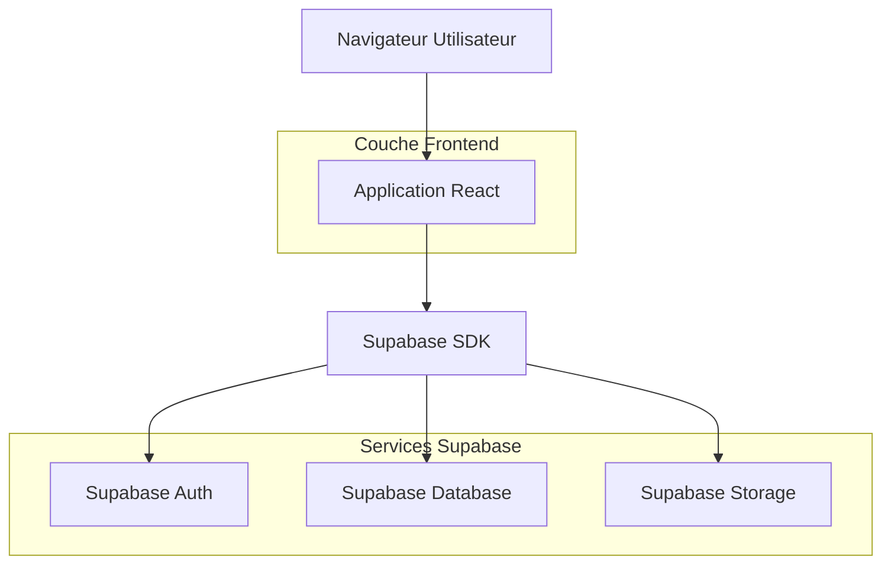
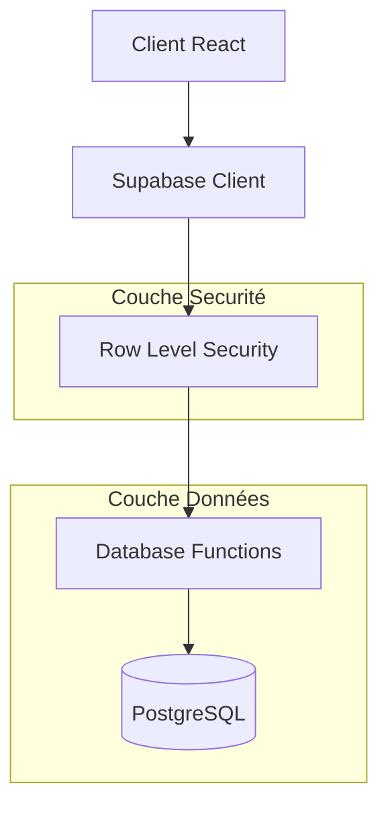
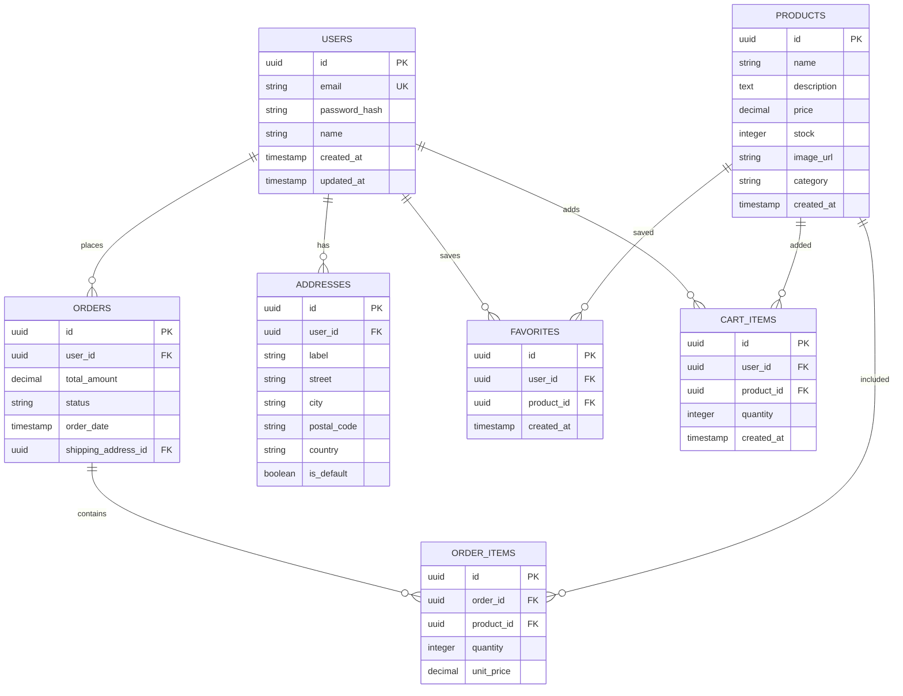

## 1. Architecture du système



## 2. Description des technologies

- **Frontend** : React@18 + TailwindCSS@3 + Vite
- **Outil d'initialisation** : vite-init
- **Backend** : Supabase (BaaS)
- **Authentification** : Supabase Auth
- **Base de données** : PostgreSQL via Supabase
- **Stockage** : Supabase Storage pour images produits

## 3. Définition des routes

| Route | Objectif |
|-------|----------|
| / | Page d'accueil, catalogue produits |
| /produit/:id | Détails produit avec galerie photos |
| /panier | Résumé et validation du panier |
| /connexion | Formulaire de connexion utilisateur |
| /inscription | Création de compte |
| /tableau-de-bord | Vue d'ensemble du compte |
| /tableau-de-bord/commandes | Historique des commandes |
| /tableau-de-bord/adresses | Gestion des adresses |
| /tableau-de-bord/favoris | Produits favoris |
| /commande/:id | Détails d'une commande spécifique |

## 4. Définitions API

### 4.1 API d'authentification

```
POST /auth/v1/token
```

Request:
| Paramètre | Type | Requis | Description |
|-----------|------|--------|-------------|
| email | string | true | Email de l'utilisateur |
| password | string | true | Mot de passe |

Response:
```json
{
  "access_token": "jwt_token",
  "token_type": "bearer",
  "expires_in": 3600,
  "refresh_token": "refresh_token",
  "user": {
    "id": "user_id",
    "email": "user@example.com"
  }
}
```

### 4.2 API produits

```
GET /rest/v1/products
```

Query parameters:
| Paramètre | Type | Description |
|-----------|------|-------------|
| select | string | Champs à récupérer |
| category | string | Filtrer par catégorie |
| order | string | Trier par champ |

## 5. Architecture serveur



## 6. Modèle de données

### 6.1 Schéma de base de données



### 6.2 Langage de définition des données

**Table utilisateurs (users)**
```sql
CREATE TABLE users (
    id UUID PRIMARY KEY DEFAULT gen_random_uuid(),
    email VARCHAR(255) UNIQUE NOT NULL,
    password_hash VARCHAR(255) NOT NULL,
    name VARCHAR(100) NOT NULL,
    created_at TIMESTAMP WITH TIME ZONE DEFAULT NOW(),
    updated_at TIMESTAMP WITH TIME ZONE DEFAULT NOW()
);

-- Index pour performances
CREATE INDEX idx_users_email ON users(email);
```

**Table produits (products)**
```sql
CREATE TABLE products (
    id UUID PRIMARY KEY DEFAULT gen_random_uuid(),
    name VARCHAR(255) NOT NULL,
    description TEXT,
    price DECIMAL(10,2) NOT NULL CHECK (price >= 0),
    stock INTEGER NOT NULL DEFAULT 0 CHECK (stock >= 0),
    image_url VARCHAR(500),
    category VARCHAR(100),
    created_at TIMESTAMP WITH TIME ZONE DEFAULT NOW()
);

-- Index pour recherche
CREATE INDEX idx_products_category ON products(category);
CREATE INDEX idx_products_name ON products(name);
```

**Table commandes (orders)**
```sql
CREATE TABLE orders (
    id UUID PRIMARY KEY DEFAULT gen_random_uuid(),
    user_id UUID REFERENCES users(id) ON DELETE CASCADE,
    total_amount DECIMAL(10,2) NOT NULL,
    status VARCHAR(50) NOT NULL DEFAULT 'pending',
    order_date TIMESTAMP WITH TIME ZONE DEFAULT NOW(),
    shipping_address_id UUID REFERENCES addresses(id)
);

-- Index pour filtrage
CREATE INDEX idx_orders_user_id ON orders(user_id);
CREATE INDEX idx_orders_status ON orders(status);
```

**Politiques de sécurité Supabase**
```sql
-- Lecture produits pour tous
GRANT SELECT ON products TO anon;

-- Accès complet pour utilisateurs authentifiés
GRANT ALL ON orders TO authenticated;
GRANT ALL ON addresses TO authenticated;
GRANT ALL ON favorites TO authenticated;
GRANT ALL ON cart_items TO authenticated;

-- Politiques RLS
ALTER TABLE orders ENABLE ROW LEVEL SECURITY;
CREATE POLICY "Users can view own orders" ON orders
    FOR SELECT USING (auth.uid() = user_id);

ALTER TABLE addresses ENABLE ROW LEVEL SECURITY;
CREATE POLICY "Users can manage own addresses" ON addresses
    FOR ALL USING (auth.uid() = user_id);
```

## 7. Configuration de sécurité

- **Authentification** : JWT tokens avec refresh automatique
- **Autorisation** : Row Level Security (RLS) sur toutes les tables utilisateur
- **Validation** : Validation côté client et serveur
- **HTTPS** : Toutes les communications chiffrées
- **Rate limiting** : Implémenté via Supabase