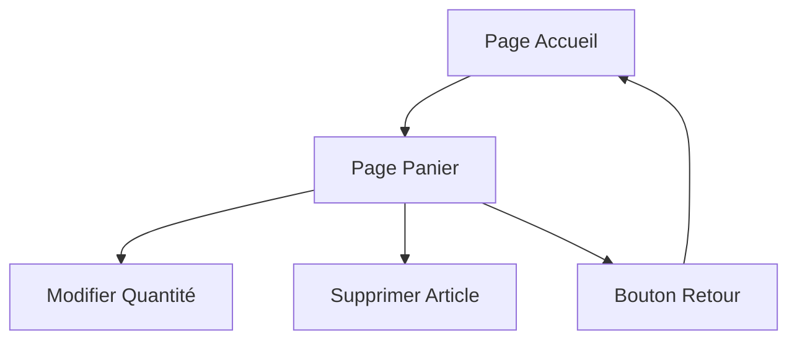

## 1. Vue d'ensemble du produit
Page de panier plein écran permettant aux utilisateurs de visualiser et gérer leurs articles sélectionnés avant l'achat.

## 2. Fonctionnalités principales

### 2.1 Module de fonctionnalités
La page panier comprend les modules suivants :
1. **Page Panier** : liste des articles, gestion quantité, suppression, total, bouton retour accueil.

### 2.2 Détails des pages
| Nom de la page | Module | Description des fonctionnalités |
|----------------|---------|-------------------------------|
| Page Panier | Liste articles | Afficher tous les articles du panier avec image, nom, prix unitaire |
| Page Panier | Gestion quantité | Permettre de modifier la quantité (+/-) avec mise à jour automatique du total |
| Page Panier | Suppression article | Bouton pour retirer un article du panier avec confirmation |
| Page Panier | Total panier | Calculer et afficher le total des articles (quantité × prix) |
| Page Panier | Bouton retour | Bouton de navigation pour retourner à la page d'accueil |

## 3. Processus principal
L'utilisateur accède à la page panier depuis n'importe quelle page via le lien panier. Il peut modifier les quantités, supprimer des articles, puis retourner à l'accueil.

## 4. Interface utilisateur

### 4.1 Style de design
- Couleurs : fond clair, accents de couleur principale
- Boutons : arrondis avec ombres subtiles
- Police : système par défaut, tailles 14-18px
- Layout : plein écran avec espacement généreux
- Icônes : style minimaliste

### 4.2 Vue d'ensemble du design
| Page | Module | Éléments UI |
|------|---------|-------------|
| Page Panier | Liste articles | Cartes horizontales avec image à gauche, détails à droite |
| Page Panier | Contrôles | Boutons +/- circulaires, icône poubelle |
| Page Panier | Total | Section collante en bas avec total en gros caractères |
| Page Panier | Navigation | Bouton retour en haut à gauche |

### 4.3 Responsive
Design desktop-first avec adaptation mobile. Optimisé pour interaction tactile sur appareils mobiles.