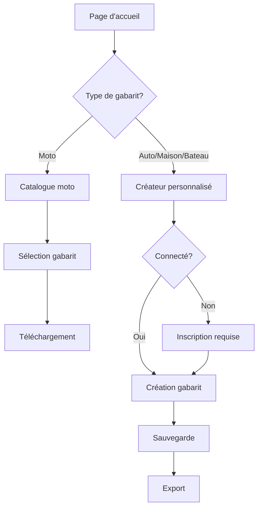

## 1. Vue d'ensemble du produit

Plateforme de création de gabarits personnalisés où les clients peuvent concevoir leurs propres gabarits pour diverses applications. Les gabarits pour motos utilisent un catalogue existant, tandis que les gabarits pour automobiles, maisons et bateaux sont créés sur mesure via un outil de conception intuitif.

**Objectif**: Permettre aux utilisateurs de créer facilement des gabarits personnalisés sans compétences techniques, avec des outils visuels et une interface simple.

## 2. Fonctionnalités principales

### 2.1 Rôles utilisateur

| Rôle | Méthode d'inscription | Permissions principales |
|------|----------------------|------------------------|
| Utilisateur gratuit | Email ou réseaux sociaux | Créer et sauvegarder jusqu'à 5 gabarits |
| Utilisateur premium | Paiement mensuel | Créer des gabarits illimités, exportation HD, support prioritaire |
| Invité | Sans inscription | Explorer le catalogue moto, tester l'outil (sans sauvegarde) |

### 2.2 Modules fonctionnels

Notre plateforme de gabarits comprend les pages principales suivantes :

1. **Page d'accueil**: Présentation des services, navigation vers les différents types de gabarits
2. **Catalogue moto**: Liste des gabarits moto prédéfinis avec prévisualisation
3. **Créateur de gabarits**: Outil de conception avec canevas SVG pour auto/maison/bateau
4. **Espace personnel**: Gestion des gabarits sauvegardés, téléchargements
5. **Page de paiement**: Upgrade vers le compte premium

### 2.3 Détails des pages

| Page | Module | Description fonctionnelle |
|------|---------|--------------------------|
| Page d'accueil | Section héro | Présente la valeur principale avec visuel attractif et CTA principal |
| Page d'accueil | Navigation | Menu vers catalogue moto et créateur personnalisé |
| Page d'accueil | Aperçu services | Cards montrant les trois types de création (moto/auto/maison/bateau) |
| Catalogue moto | Grille de gabarits | Affichage en grille avec miniatures, filtres par catégorie |
| Catalogue moto | Prévisualisation | Aperçu en grand format avec dimensions et détails |
| Catalogue moto | Téléchargement | Bouton pour télécharger le gabarit sélectionné (PDF/SVG) |
| Créateur de gabarits | Canevas SVG | Zone de dessin principale avec grille d'assistance et rulers |
| Créateur de gabarits | Outils de dessin | Sélection, ligne, rectangle, cercle, texte, couleurs |
| Créateur de gabarits | Panneau latéral | Propriétés de l'objet sélectionné, calques, historique |
| Créateur de gabarits | Actions | Sauvegarder, exporter, annuler/refaire, zoom |
| Espace personnel | Bibliothèque | Liste des gabarits créés avec vignettes et dates |
| Espace personnel | Actions | Modifier, dupliquer, supprimer, exporter |
| Page de paiement | Formule premium | Présentation des avantages et bouton d'abonnement |

## 3. Processus principaux

### Flux utilisateur standard :

1. **Nouvel utilisateur**: Landing page → Explore catalogue moto → Test créateur → Inscription → Création personnalisée
2. **Utilisateur existant**: Connexion → Accès espace personnel → Création/modification → Export
3. **Achat premium**: Espace personnel → Page de paiement → Activation premium

### Flux décisionnel :

## 4. Design de l'interface

### 4.1 Style de design

- **Couleurs principales**: Bleu moderne (#2563EB) pour les actions principales, gris neutre (#6B7280) pour le texte
- **Couleurs secondaires**: Vert (#10B981) pour succès, orange (#F59E0B) pour avertissements
- **Boutons**: Style arrondi avec ombre portée subtile, effet hover avec transition
- **Typographie**: Inter pour titres, Roboto pour corps de texte
- **Icônes**: Style line-icons minimalistes, emoji pour les catégories de gabarits
- **Layout**: Card-based avec espaces généreux, navigation sticky en haut

### 4.2 Vue d'ensemble des pages

| Page | Module | Éléments UI |
|------|---------|-------------|
| Page d'accueil | Section héro | Image de fond avec overlay sombre, titre en 48px gras blanc, sous-titre 20px, CTA principal en bouton bleu 16px |
| Page d'accueil | Navigation | Logo à gauche, menu centré, bouton connexion à droite, fond blanc avec ombre |
| Catalogue moto | Grille | Cards 300px avec image, titre, dimensions, bouton télécharger, hover effect scale(1.02) |
| Créateur | Canevas | Zone blanche avec grille pointillée, rulers sur les côtés, barre d'outils verticale à gauche |
| Créateur | Outils | Icônes 24px en colonne, sélection avec bordure bleue, tooltip au survol |
| Espace perso | Bibliothèque | Grid responsive, cards avec vignette, nom, date, actions en hover |

### 4.3 Responsive

- **Approche**: Desktop-first avec adaptation mobile
- **Breakpoints**: 768px (tablette), 480px (mobile)
- **Adaptations**: Menu hamburger mobile, canevas avec pinch-zoom tactile, boutons plus grands pour touch

## 5. Spécifications techniques

### 5.1 Format des gabarits

- **Format source**: SVG pour conservation qualité vectorielle
- **Formats export**: PDF (impression), SVG (édition), PNG (aperçu)
- **Résolution**: Vectorielle pour PDF/SVG, 300DPI pour PNG exports
- **Dimensions**: Prédéfinies par catégorie (A4 pour auto, A3 pour maison, personnalisables)

### 5.2 Fonctionnalités avancées

- **Grille magnétique**: Alignement automatique des objets
- **Calques**: Gestion de la profondeur avec drag & drop
- **Templates**: Gabarits de base pour démarrer rapidement
- **Collaboration**: Partage de gabarits avec lien unique (premium)
- **Versioning**: Historique des modifications avec rollback

### 5.3 Performance

- **Chargement**: < 3 secondes pour le créateur
- **Temps de réponse**: < 100ms pour les opérations de dessin
- **Taille max**: 10MB par fichier SVG
- **Optimisation**: Lazy loading pour les images, compression SVG côté serveur