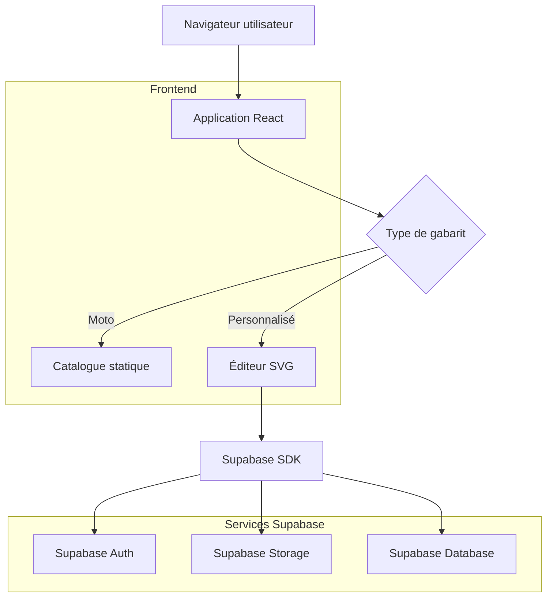
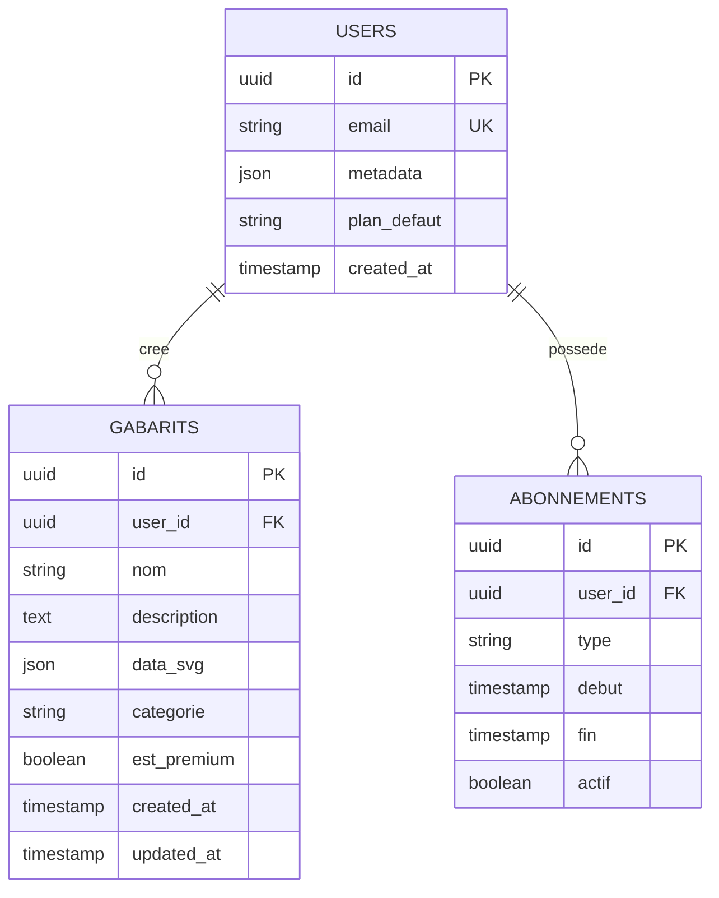

## 1. Architecture du système



## 2. Description des technologies

- **Frontend**: React@18 + TypeScript + Vite
- **Styling**: TailwindCSS@3 + HeadlessUI
- **Éditeur SVG**: Fabric.js@5 pour manipulation canvas
- **Gestion d'état**: Zustand
- **Backend**: Supabase (BaaS complet)
- **Outil d'initialisation**: vite-init

## 3. Définition des routes

| Route | Objectif |
|-------|----------|
| / | Page d'accueil avec présentation des services |
| /catalogue/moto | Catalogue des gabarits moto prédéfinis |
| /createur | Éditeur de gabarits personnalisés |
| /profil | Espace personnel de l'utilisateur |
| /abonnement | Page d'upgrade vers premium |
| /auth | Page de connexion/inscription |

## 4. Structure de la base de données

### 4.1 Modèle de données



### 4.2 Définition des tables

**Table users**
```sql
CREATE TABLE users (
    id UUID PRIMARY KEY DEFAULT gen_random_uuid(),
    email VARCHAR(255) UNIQUE NOT NULL,
    raw_user_meta_data JSONB,
    plan VARCHAR(20) DEFAULT 'free' CHECK (plan IN ('free', 'premium')),
    created_at TIMESTAMP WITH TIME ZONE DEFAULT NOW()
);
```

**Table gabarits**
```sql
CREATE TABLE gabarits (
    id UUID PRIMARY KEY DEFAULT gen_random_uuid(),
    user_id UUID REFERENCES auth.users(id) ON DELETE CASCADE,
    nom VARCHAR(255) NOT NULL,
    description TEXT,
    data_svg JSONB NOT NULL,
    categorie VARCHAR(50) CHECK (categorie IN ('auto', 'moto', 'maison', 'bateau')),
    est_premium BOOLEAN DEFAULT false,
    created_at TIMESTAMP WITH TIME ZONE DEFAULT NOW(),
    updated_at TIMESTAMP WITH TIME ZONE DEFAULT NOW()
);

CREATE INDEX idx_gabarits_user_id ON gabarits(user_id);
CREATE INDEX idx_gabarits_categorie ON gabarits(categorie);
```

**Table abonnements**
```sql
CREATE TABLE abonnements (
    id UUID PRIMARY KEY DEFAULT gen_random_uuid(),
    user_id UUID REFERENCES auth.users(id) ON DELETE CASCADE,
    type VARCHAR(20) CHECK (type IN ('mensuel', 'annuel')),
    debut TIMESTAMP WITH TIME ZONE DEFAULT NOW(),
    fin TIMESTAMP WITH TIME ZONE,
    actif BOOLEAN DEFAULT true
);
```

### 4.3 Politiques de sécurité Supabase

```sql
-- Accès public pour les gabarits non premium
GRANT SELECT ON gabarits TO anon;
GRANT SELECT ON gabarits TO authenticated;

-- Accès complet pour les utilisateurs authentifiés sur leurs propres gabarits
CREATE POLICY "Users can manage their own gabarits" ON gabarits
    FOR ALL USING (auth.uid() = user_id);

-- Les utilisateurs premium peuvent accéder aux gabarits premium
CREATE POLICY "Premium users can access premium content" ON gabarits
    FOR SELECT USING (
        est_premium = false OR 
        auth.uid() IN (
            SELECT user_id FROM abonnements 
            WHERE actif = true AND fin > NOW()
        )
    );
```

## 5. Architecture du frontend

### 5.1 Structure des composants

```
src/
├── components/
│   ├── common/
│   │   ├── Header.tsx
│   │   ├── Footer.tsx
│   │   └── AuthGuard.tsx
│   ├── editor/
│   │   ├── SVCanvas.tsx
│   │   ├── ToolPanel.tsx
│   │   ├── PropertyPanel.tsx
│   │   └── ExportDialog.tsx
│   └── catalogue/
│       ├── MotoGrid.tsx
│       ├── MotoCard.tsx
│       └── PreviewModal.tsx
├── hooks/
│   ├── useAuth.ts
│   ├── useGabarits.ts
│   └── useEditor.ts
├── stores/
│   ├── authStore.ts
│   ├── editorStore.ts
│   └── gabaritStore.ts
└── utils/
    ├── svgHelpers.ts
    ├── exportHelpers.ts
    └── validation.ts
```

### 5.2 Gestion d'état avec Zustand

```typescript
// stores/editorStore.ts
interface EditorState {
  canvas: fabric.Canvas | null
  selectedObjects: fabric.Object[]
  history: string[]
  currentHistoryIndex: number
  
  setCanvas: (canvas: fabric.Canvas) => void
  addToHistory: (state: string) => void
  undo: () => void
  redo: () => void
  updateSelection: () => void
}
```

## 6. Fonctionnalités techniques

### 6.1 Éditeur SVG

- **Bibliothèque**: Fabric.js pour manipulation canvas
- **Formats supportés**: SVG import/export, PDF génération côté client
- **Outils**: Sélection, dessin (ligne, rectangle, cercle), texte, couleurs
- **Fonctions**: Undo/redo, calques, grille magnétique, zoom

### 6.2 Stockage des fichiers

- **Petits fichiers (< 1MB)**: Stockage direct en base64 dans la BDD
- **Fichiers moyens (1-10MB)**: Supabase Storage avec UUID comme référence
- **Optimisation**: Compression SVG côté client avant upload

### 6.3 Export et téléchargement

```typescript
// utils/exportHelpers.ts
export const exportGabarit = async (
  canvas: fabric.Canvas,
  format: 'svg' | 'pdf' | 'png',
  filename: string
) => {
  switch (format) {
    case 'svg':
      return canvas.toSVG()
    case 'pdf':
      return generatePDF(canvas)
    case 'png':
      return canvas.toDataURL({ format: 'png', multiplier: 3 })
  }
}
```

## 7. Performance et optimisation

### 7.1 Optimisations frontend

- **Code splitting**: Chargement paresseux de l'éditeur
- **Mémoisation**: Cache des gabarits fréquemment utilisés
- **Debouncing**: Sauvegarde automatique toutes les 5 secondes
- **Compression**: Gzip activé sur toutes les réponses

### 7.2 Limitations et quotas

- **Utilisateur gratuit**: 5 gabarits max, 5MB par gabarit
- **Utilisateur premium**: Illimité, 50MB par gabarit
- **Requêtes API**: 100/h pour free, 1000/h pour premium
- **Bande passante**: 1GB/mois pour free, 10GB/mois pour premium