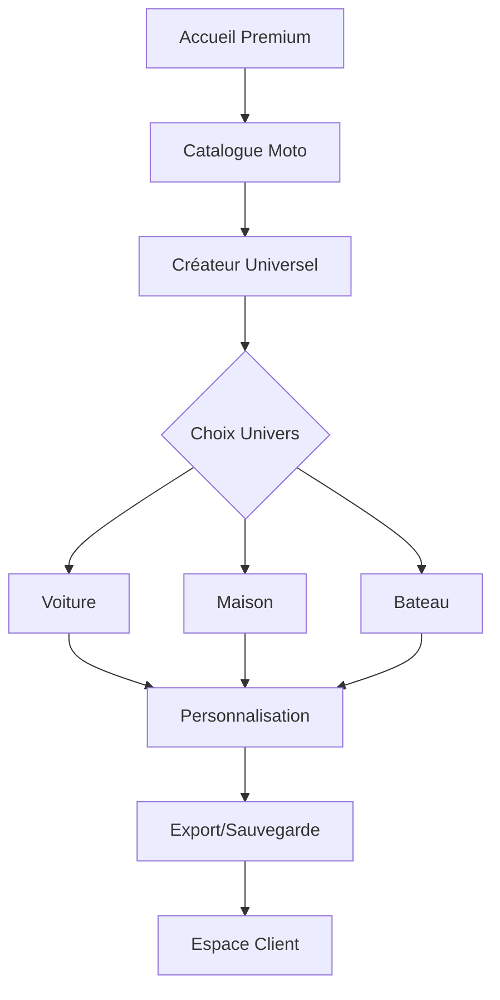

## 1. Vue d'ensemble du produit
Plateforme premium de création et de gestion de gabarits personnalisés pour véhicules (motos, voitures, bateaux) et habitations. Refonte complète avec interface professionnelle et consolidation du catalogue moto dans un espace unique.

Objectif : Offrir une expérience utilisateur fluide et professionnelle permettant aux clients de créer facilement leurs propres gabarits pour différents types de projets.

## 2. Fonctionnalités principales

### 2.1 Rôles utilisateurs
| Rôle | Méthode d'inscription | Permissions principales |
|------|---------------------|----------------------|
| Visiteur | Sans inscription | Consulter le catalogue moto, accéder au créateur de gabarits |
| Client Premium | Email + abonnement | Accès complet, sauvegarde de gabarits, export haute résolution |
| Administrateur | Création manuelle | Gestion complète du catalogue, modération des gabarits |

### 2.2 Modules fonctionnels
Notre plateforme de gabarits premium comprend les pages essentielles suivantes :

1. **Page d'accueil premium** : Hero section avec vidéo de présentation, navigation élégante, vitrine des fonctionnalités
2. **Catalogue moto consolidé** : Grille de gabarits moto avec filtres avancés, aperçu rapide, téléchargement
3. **Créateur de gabarits universel** : Interface de création pour voiture/maison/bateau avec outils professionnels
4. **Espace client** : Dashboard personnel, historique des créations, paramètres du compte
5. **Page de support** : Tutoriels, FAQ, contact professionnel

### 2.3 Détail des pages
| Page | Module | Description fonctionnelle |
|------|--------|--------------------------|
| Accueil premium | Hero section | Vidéo d'introduction auto-play, titre animé, CTA principal vers le créateur |
| Accueil premium | Navigation | Menu sticky avec effet de scroll, logo premium, bouton d'accès client |
| Accueil premium | Fonctionnalités | Cards animées présentant les 3 univers (moto/voiture+maison+bateau) |
| Catalogue moto | Grille de gabarits | Layout masonry responsive, vignettes HD avec hover effects |
| Catalogue moto | Filtres avancés | Filtres par marque, modèle, année, avec recherche instantanée |
| Catalogue moto | Aperçu rapide | Modal avec rotation 360°, zoom, spécifications techniques |
| Créateur universel | Sélection univers | Boutons larges pour choisir entre voiture/maison/bateau |
| Créateur universel | Outils de création | Grille de précision, snaps, calques, undo/redo, sauvegarde auto |
| Créateur universel | Personnalisation | Palette de couleurs, textures, dimensions personnalisées |
| Espace client | Dashboard | Vue d'ensemble des projets, statistiques d'utilisation |
| Espace client | Bibliothèque | Organisation par dossiers, partage, duplication |
| Support | Centre d'aide | Articles catégorisés, recherche, vidéos tutoriels |

## 3. Processus principaux

### Flux utilisateur principal
1. **Découverte** : L'utilisateur arrive sur la page d'accueil premium et découvre les possibilités
2. **Exploration** : Il consulte le catalogue moto consolidé pour voir la qualité des gabarits
3. **Création** : Il accède au créateur universel et choisit son univers (voiture/maison/bateau)
4. **Personnalisation** : Il crée son gabarit avec les outils professionnels
5. **Export** : Il télécharge ou sauvegarde son création dans son espace client

### Flux client premium

## 4. Design de l'interface

### 4.1 Style visuel
- **Couleurs** : Noir mat (#1a1a1a), Or premium (#d4af37), Blanc pur (#ffffff), Gris aluminium (#8a8a8a)
- **Typographie** : Montserrat pour les titres, Open Sans pour le corps, tailles 14-48px
- **Boutons** : Style néo-morphique avec ombres douces, hover effects subtils
- **Layout** : Grid de 12 colonnes, espacement conséquent (32px), cards avec coins arrondis (12px)
- **Icônes** : Style outline premium, animations de micro-interaction

### 4.2 Vue d'ensemble des pages
| Page | Module | Éléments UI |
|------|--------|-------------|
| Accueil | Hero | Vidéo en background avec overlay sombre, titre 72px animé, CTA premium |
| Catalogue | Grille | Cards 300x400px avec hover zoom, badges "Nouveau", bouton télécharger |
| Créateur | Toolbar | Barre latérale 80px avec icônes, palette couleurs flottante, règles de précision |
| Espace client | Dashboard | Widgets avec métriques, graphiques en courbes, tableau projets responsive |

### 4.3 Responsive
- **Desktop-first** : Optimisé pour écrans 1440px et plus
- **Breakpoints** : 1200px, 768px, 480px
- **Mobile** : Navigation hamburger, cards empilées, créateur avec gestes tactiles

### 4.4 Animations et transitions
- Parallax subtil sur l'accueil (0.5x speed)
- Fade-in des éléments au scroll (0.3s ease-out)
- Transitions fluides entre pages (0.2s)
- Micro-interactions sur les boutons (scale 1.05 on hover)