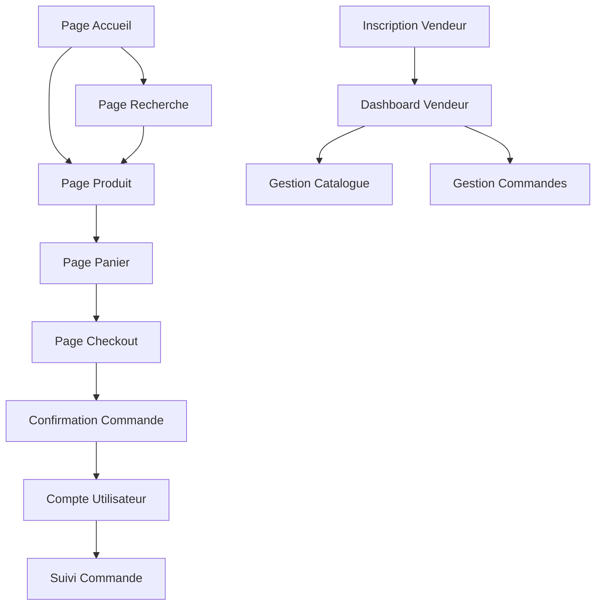

## 1. Vue d'ensemble du produit
Marketplace e-commerce de nouvelle génération surpassant Amazon avec une expérience utilisateur ultra-intuitive, un design moderne et attractif, et des fonctionnalités innovantes pour l'achat et la vente en ligne.

Le produit résout les problèmes d'expérience utilisateur frustrante sur les marketplaces existantes, en offrant une navigation fluide, une recherche intelligente et un processus d'achat simplifié pour les acheteurs, tout en fournissant des outils puissants de gestion pour les vendeurs.

## 2. Fonctionnalités principales

### 2.1 Rôles utilisateurs

| Rôle | Méthode d'inscription | Permissions principales |
|------|----------------------|------------------------|
| Acheteur | Email, réseaux sociaux | Parcourir, acheter, suivre commandes, laisser avis |
| Vendeur | Vérification d'identité requise | Gérer catalogue, stocks, commandes, analytics |
| Admin | Invitation uniquement | Gérer utilisateurs, résoudre litiges, modérer contenu |

### 2.2 Modules fonctionnels

Notre marketplace comprend les pages essentielles suivantes :

1. **Page d'accueil** : hero section avec produits tendance, catégories populaires, offres flash
2. **Page de recherche** : filtres avancés, tri intelligent, suggestions en temps réel
3. **Page produit** : galerie photo immersive, avis détaillés, recommandations personnalisées
4. **Page panier** : résumé visuel, calcul frais livraison, suggestions complémentaires
5. **Page checkout** : processus simplifié, multiples options paiement, suivi livraison
6. **Compte utilisateur** : tableau de bord personnalisé, historique, wishlist
7. **Dashboard vendeur** : analytics ventes, gestion inventaire, outils marketing

### 2.3 Détail des pages

| Page | Module | Description fonctionnalité |
|------|---------|---------------------------|
| Accueil | Hero banner | Carousel automatique avec promotions principales, animation fluide toutes les 5 secondes |
| Accueil | Barre recherche | Recherche instantanée avec auto-complétion, suggestions basées sur historique |
| Accueil | Catégories | Navigation visuelle par icônes, accès rapide aux principales catégories |
| Accueil | Produits tendance | Grille dynamique avec badges "Nouveau" et "Meilleure vente", chargement infini |
| Recherche | Filtres avancés | Filtres par prix, marque, notation, livraison, avec compteur de résultats en temps réel |
| Recherche | Résultats | Vue grille/liste interchangeable, tri par pertinence/prix/avis, badges promotionnels |
| Produit | Galerie photo | Visionneuse 360°, zoom au survol, vidéos produit, comparateur visuel |
| Produit | Informations | Description enrichie avec tableaux comparatifs, spécifications détaillées |
| Produit | Avis clients | Système notation étoiles + commentaires, tri par pertinence/date, photos utilisateurs |
| Produit | Recommandations | Algorithmes IA suggérant produits complémentaires et alternatifs |
| Panier | Résumé visuel | Miniatures produits, quantité modifiable, prix total dynamique avec animations |
| Panier | Suggestions | Produits fréquemment achetés ensemble avec bouton "Ajouter tout" |
| Checkout | Processus étapes | Progress bar visuelle, sauvegarde automatique progression, retour arrière fluide |
| Checkout | Paiement | Multiples gateways (carte, PayPal, Apple Pay), sécurité 3D-Secure |
| Compte | Dashboard | Widgets personnalisables, raccourcis vers actions fréquentes |
| Compte | Commandes | Timeline visuelle statut livraison, bouton "Répéter commande" |
| Vendeur | Analytics | Graphiques ventes en temps réel, top produits, insights IA |
| Vendeur | Inventaire | Tableau éditable inline, alertes stock faible, import/export CSV |

## 3. Processus principaux

### Flux acheteur
L'utilisateur découvre des produits via la page d'accueil ou la recherche, consulte les détails produit avec avis et recommandations, ajoute au panier avec suggestions intelligentes, passe commande via un checkout optimisé, puis suit sa commande dans son espace personnel.

### Flux vendeur
Le vendeur crée son compte avec vérification d'identité, configure sa boutique et catalogue produits, suit ses ventes et analytics via le dashboard, gère les commandes et stocks, et optimise ses listings basé sur les données de performance.

## 4. Design de l'interface

### 4.1 Style de design
- **Couleurs principales** : Orange vif (#FF6B35) pour actions principales, Bleu nuit (#1A365D) pour header/footer
- **Couleurs secondaires** : Gris clair (#F7FAFC) backgrounds, Vert succès (#38A169) pour validations
- **Boutons** : Style arrondi avec ombres subtiles, effet hover scale(1.05) et transition fluide
- **Typographie** : Inter pour titres (bold, 24-32px), Open Sans pour corps texte (16px base)
- **Icônes** : Style line-icons modernes, animations micro-interactions au survol
- **Layout** : Design card-based avec espaces généreux, grid responsive 12 colonnes

### 4.2 Aperçu du design par page

| Page | Module | Éléments UI |
|------|---------|-------------|
| Accueil | Hero banner | Images fullscreen avec overlay dégradé, texte animé slide-in, CTA bouton pulsant |
| Accueil | Navigation | Header sticky avec blur effect, mega-menu catégories avec images miniatures |
| Recherche | Filtres sidebar | Accordéons animés, sliders prix avec dual-handle, tags sélectionnables |
| Produit | Galerie | Thumbnail carousel horizontal, bouton fullscreen, indicateur zoom au survol |
| Panier | Items list | Cards avec suppression animate (fade-out), quantité stepper avec +/- |
| Checkout | Formulaires | Champs avec labels flottants, validation visuelle instantanée, progress steps |
| Compte | Dashboard | Widgets avec graphs Chart.js, cartes métriques avec icônes colorées |

### 4.3 Responsive design
Approche desktop-first avec breakpoints :
- Desktop : 1200px+ (expérience complète avec sidebar, mega-menus)
- Tablet : 768-1199px (navigation hamburger, grille adaptative)
- Mobile : <768px (interface tactile optimisée, swipe gestures, bottom navigation)

Optimisations tactiles : boutons 44px minimum, espacement 8px grid system, swipe carousel produits.

### 4.4 Animations et micro-interactions
- Loading states : Skeleton screens animés, spinners modernes
- Transitions : Page fades 300ms, card hovers avec scale et ombre
- Feedback : Toasts notifications, boutons avec états visuels clairs
- Scroll : Parallax subtil sur hero, reveal animations au scroll