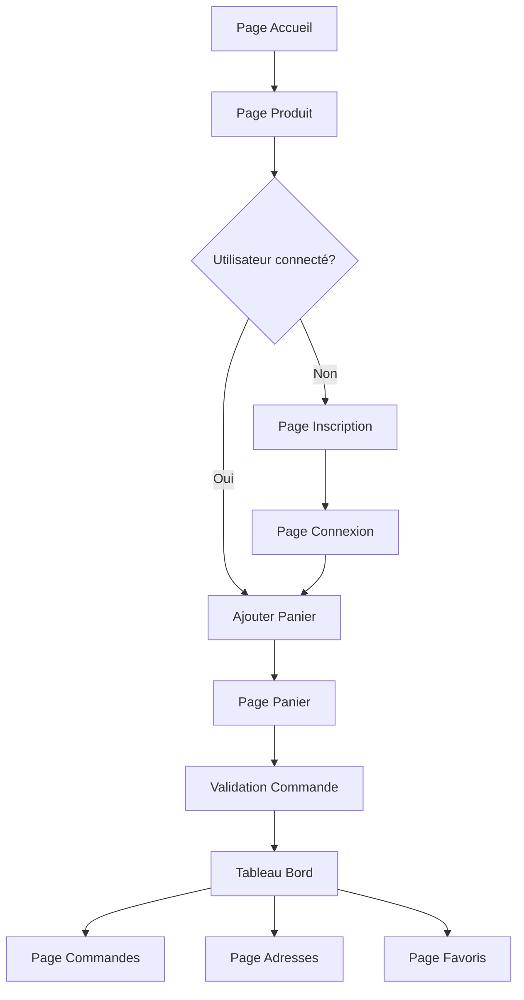

## 1. Vue d'ensemble du produit
Plateforme e-commerce avec tableau de bord utilisateur complet incluant gestion des commandes, adresses et favoris. Les utilisateurs doivent se connecter avant de passer commande pour garantir la sécurité et personnaliser l'expérience.

Solution responsive conçue pour offrir une expérience fluide sur desktop et mobile, avec une interface intuitive inspirée des standards du marché e-commerce.

## 2. Fonctionnalités principales

### 2.1 Rôles utilisateur
| Rôle | Méthode d'inscription | Permissions principales |
|------|----------------------|------------------------|
| Utilisateur | Email + mot de passe | Consulter produits, gérer compte, passer commandes |
| Invité | Sans inscription | Consulter produits, obligation de créer compte pour commander |

### 2.2 Modules fonctionnels
Plateforme e-commerce avec les pages essentielles suivantes :
1. **Page d'accueil** : catalogue produits, navigation, recherche
2. **Page produit** : détails, ajout favoris, sélection quantité
3. **Page panier** : résumé, modification quantités, total
4. **Page connexion/inscription** : formulaires sécurisés
5. **Tableau de bord utilisateur** : vue d'ensemble du compte
6. **Page commandes** : historique et détails des commandes
7. **Page adresses** : gestion des adresses de livraison
8. **Page favoris** : produits sauvegardés

### 2.3 Détail des pages
| Page | Module | Description fonctionnelle |
|------|--------|---------------------------|
| Page d'accueil | Catalogue | Afficher grille produits avec images, prix, bouton favori |
| Page d'accueil | Recherche | Barre de recherche avec filtres par catégorie |
| Page produit | Galerie photo | Carousel d'images avec zoom |
| Page produit | Informations | Titre, prix, description, stock disponible |
| Page produit | Actions | Ajouter au panier, ajouter aux favoris |
| Page panier | Résumé | Liste produits avec quantités modifiables |
| Page panier | Total | Calcul automatique avec frais de livraison |
| Page connexion | Formulaire | Email/mot de passe avec validation |
| Page inscription | Formulaire | Email, mot de passe, confirmation |
| Tableau de bord | Navigation | Menu latéral vers sections principales |
| Tableau de bord | Résumé | Dernières commandes, favoris récents |
| Page commandes | Historique | Liste chronologique avec statuts |
| Page commandes | Détails | Produits, quantités, prix total |
| Page adresses | Liste | Adresses enregistrées avec édition/suppression |
| Page adresses | Ajout | Formulaire d'ajout d'adresse |
| Page favoris | Grille | Produits favoris avec prix et disponibilité |

## 3. Processus principaux

### Flux utilisateur connecté
1. Navigation catalogue → Consultation produits
2. Ajout favoris → Sauvegarde en base
3. Ajout panier → Quantité et options
4. Validation panier → Vérification stock
5. Sélection adresse → Adresses enregistrées
6. Paiement → Processus sécurisé
7. Confirmation → Numéro de commande

### Flux nouvel utilisateur
1. Ajout panier → Redirection inscription obligatoire
2. Création compte → Validation email
3. Connexion → Accès commande

## 4. Interface utilisateur

### 4.1 Style de design
- **Couleurs** : Bleu principal (#2563EB), gris clair (#F3F4F6), blanc
- **Boutons** : Arrondis avec ombre portée, états hover visibles
- **Typographie** : Inter 16px corps, 14px secondaire, 20px titres
- **Layout** : Cartes avec bordures subtiles, grille responsive
- **Icônes** : Heroicons outline, coeur pour favoris

### 4.2 Vue d'ensemble par page
| Page | Module | Éléments UI |
|------|--------|-------------|
| Accueil | Grille produits | Cards 4 colonnes desktop, 1 colonne mobile |
| Accueil | Header | Navigation sticky, logo gauche, compte droite |
| Produit | Carousel | Images 500x500px, navigation points |
| Produit | CTA | Bouton principal large, secondaire outline |
| Panier | Table | Lignes séparées, boutons +/- quantité |
| Connexion | Formulaire | Inputs larges, labels au-dessus |
| Tableau bord | Menu | Sidebar 250px desktop, hamburger mobile |
| Commandes | Timeline | Statuts avec icônes, progression visuelle |
| Adresses | Cards | Une carte par adresse, boutons d'action |
| Favoris | Grille | Même style que catalogue, coeur rempli |

### 4.3 Responsive
Design desktop-first avec breakpoints :
- Desktop : 1280px+ (layout complet)
- Tablette : 768-1279px (sidebar devient drawer)
- Mobile : <768px (navigation en bas, 1 colonne)

Optimisation tactile : boutons 44px minimum, espacement 8px, swipe sur carousels.